在网页设计中，有时会在页面的右下角放一些图标，在点击它们的时候可以实现一些功能。但是当图标太多时，直接把它们堆叠在右下角会显得过于拥挤，此时就可以考虑通过动画的方式实现。

如下图所示：

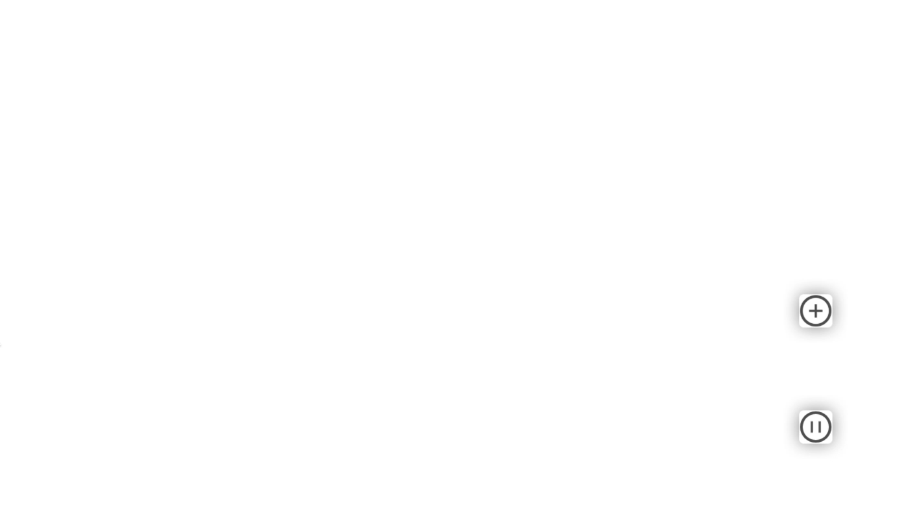

当点击第一个图标时，另外两个图标会以一个弧度弹出，再次点击，它们就收起。

下面我们一起实现这个设计。

首先我们来分析这个动画的形式，页面初始化时，右下角有两个垂直排列的图标，并且上面的图标背后隐藏两个图标，在点击时以一个弧度弹出，弧度的圆心是下面图标的中心。下面来看代码：

## html骨架

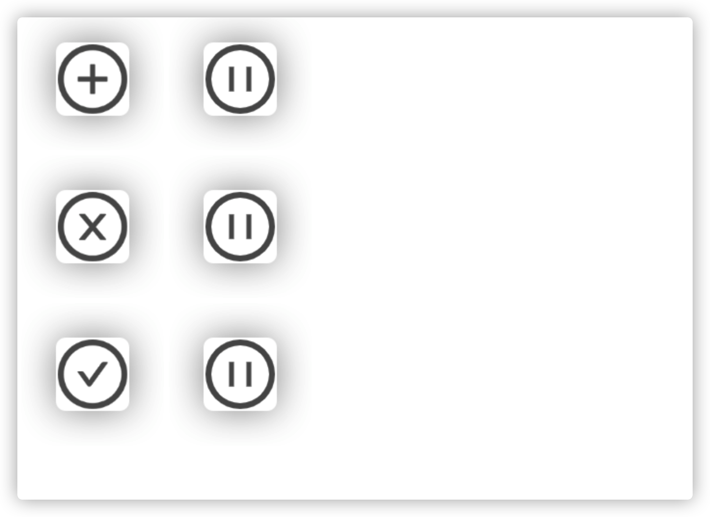

```html
<body>
  <!-- 总共是三个div，每一个div都加上了一个类icon-container，每个div中包含两个img，第二个img可以用来占位。 -->
  <div class="icon-container">
    
    
  </div>
  <div class="icon-container">
    
    
  </div>
  <div class="icon-container">
    
    
  </div>
</body>
```
## 基本样式
使图标都位于页面右下角，并且为垂直排列，而且加号和暂停图标背后分别都藏着两个图标。

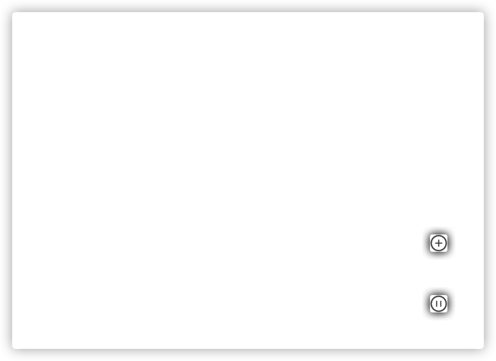

```css
/* 使图标容器采用固定定位，并且距离页面右边是50像素，距离页面底部也是50像素，
这样无论页面大小如何变化或页面如何滚动，我们的图标就始终能保持在页面右下角。*/
.icon-container {
  position: fixed;
  right: 50px;
  bottom: 50px;
}

/* :nth-of-type(n)的功能是选择当前元素是第n个子元素。我们的图标容器都是body的子元素，
那么.icon-container:nth-of-type(1)也就是选择了第一个图标容器，设置z-index，使它始终位于其他图标容器的上方。*/
.icon-container:nth-of-type(1) {
  z-index: 1;
}

/* 设置img为块元素，使每个图标都能占据一行，每个图标的宽高分别设置为50像素*/
img {
  display: block;
  width: 50px;
  height: 50px;
}

/* 把图标容器中的第二个图标的上边距设置为40像素，使两个图标之间撑开一些距离 */
img:nth-of-type(2){
  margin-top: 40px;
}
```
## 弹出隐藏图标
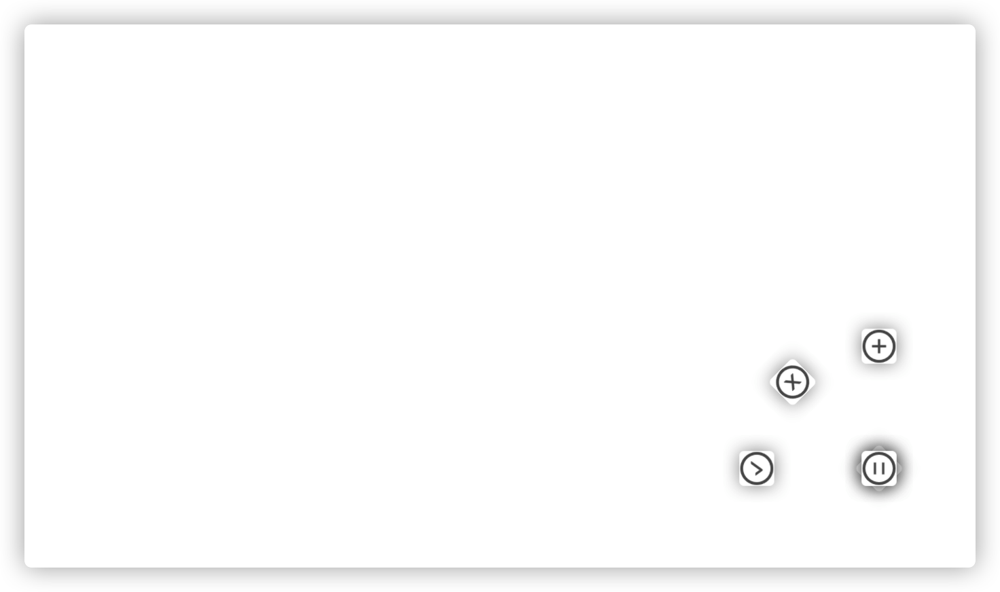
```html
<body>
  <div class="icon-container">
    
    
  </div>
  <!-- 注意我们给第二和第三个图标容器分别加了一个类icon-rotate。
  为什么要再加一个类呢？因为我们后面会用脚本在点击时动态地给它们添加这个类，
  如果直接在icon-container里面写样式，做动态添加就不太方便了 -->
  <div class="icon-rotate icon-container">
    
    
  </div>
  <!-- icon-rotate -->
  <div class="icon-rotate icon-container">
    
    
  </div>
</body>
```
样式：
```css
/* transform是变形属性，rotate()是一种变形函数，
意思是以元素的中心为原点把元素旋转一定的角度，
正数顺时针、负数逆时针 */
.icon-rotate:nth-of-type(2) {
  transform: rotate(-45deg);
} 

.icon-rotate:nth-of-type(3) {
  transform: rotate(-90deg);
}

/* transform-origin可以设置变形的基础点。transform-origin：0 0 是元素的左上角，
这里的意思是从左上角开始，沿着x轴向右移动25像素，沿着y轴向下移动115像素，
这样就把旋转的圆心从中心位置改为了暂停图标的中心 */
.icon-rotate {
  transform-origin: 25px 115px;
}
```
### 下面的例子可以帮助理解rotate()
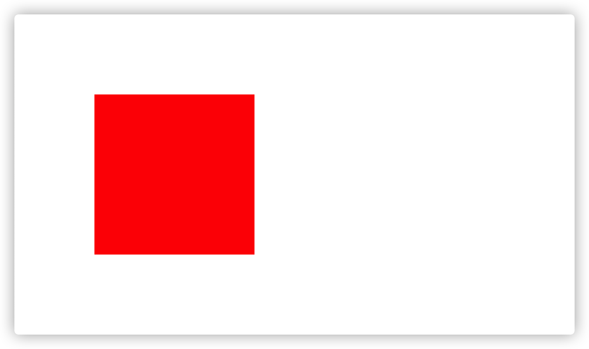
```html
<body>
  <!-- 这里有三个div元素，分别是outer、inner和center，inner元素上还有一个rotate类 -->
  <div class="outer">
    <div class="inner rotate"></div>
  </div>
  <div class="center"></div>
</body>
```

```css
/* 外部元素采用固定定位，背景为红色，宽高分别为200像素，距离浏览器左边和上面分别为100像素 */
.outer {
  position: fixed;
  background: red;
  width: 200px;
  height: 200px;
  left: 100px;
  top: 100px;
}
```
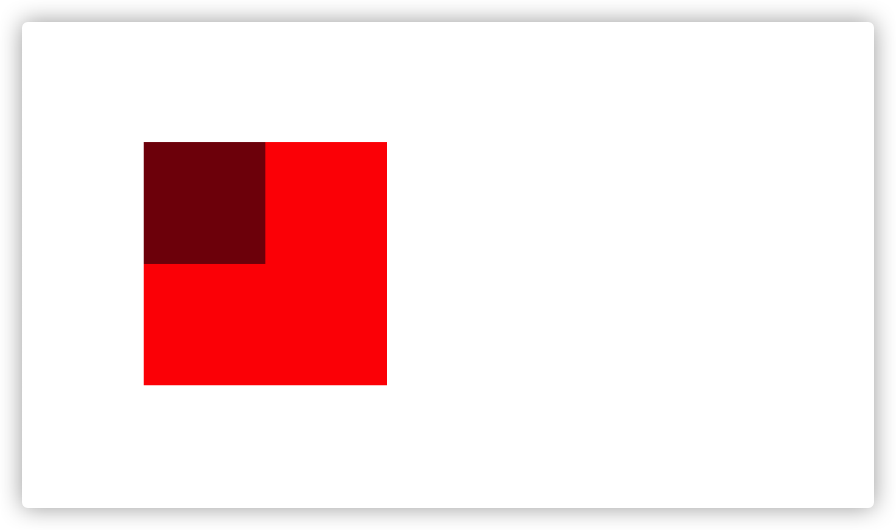
```css
/* 中央元素也是固定定位，背景色为黑色，并且半透明，宽高分别为100像素，
距离浏览器左边和上边也同样都是100像素，这样设置后，
中央元素的右下角恰好是外部元素的中心 */
.center {
  position: fixed;
  background: black;
  opacity: 0.5;
  width: 100px;
  height: 100px;
  left: 100px;
  top: 100px;
}
```

```css
.inner {
  /* 内部元素背景色设置为蓝色，也是半透明，宽高和外部元素一样都是200像素，
  这样内部元素和外部元素一样，可以很方便的看出内部元素的中心 */
  background: blue;
  opacity: 0.5;
  width: 200px;
  height: 200px;
}
```
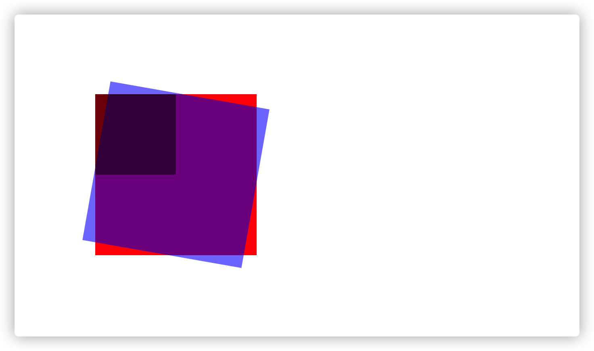
```css
.rotate {
  /* 内部元素围绕自身的中心点顺时针转动了10度 */
  transform: rotate(10deg);
}
```
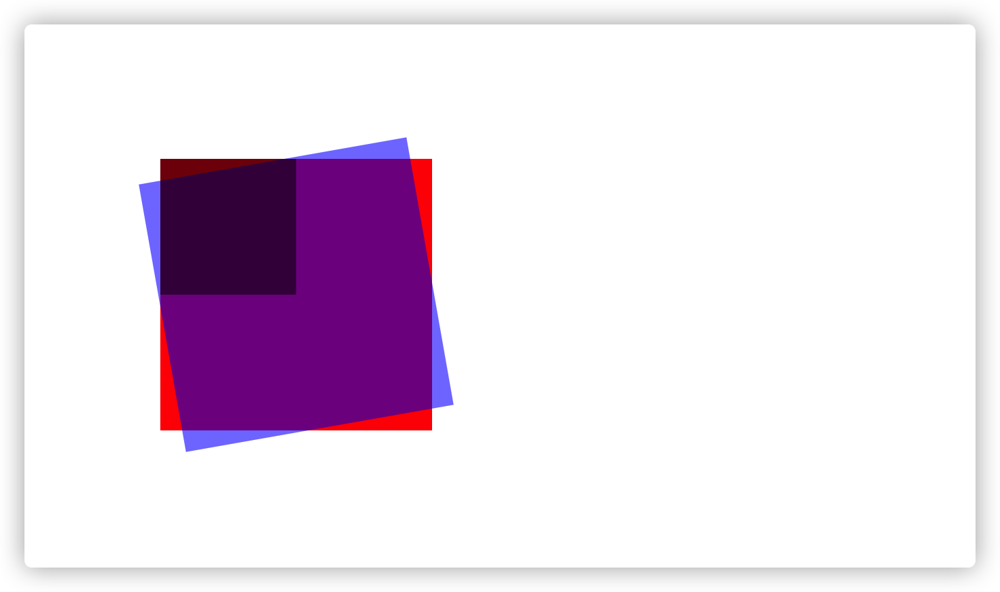
```css
.rotate {
  /* 内部元素围绕自身中心点逆时针转动了10度 */
  transform: rotate(-10deg);
}
```
`rotate()`接收一个参数时，如果参数为正，元素则围绕自身的中心点顺时针转动相应的度数；如果参数为负，则是逆时针。

再看下面：

```css
.rotate {
  /* 围绕自身的左上角顺时针转动了10度 */
  transform: rotate(10deg);
  transform-origin: 0 0;
}
```
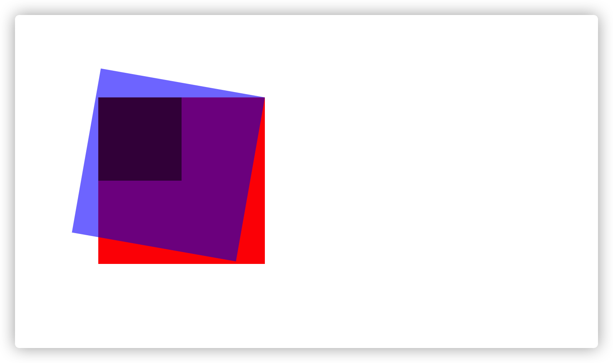
```css
.rotate {
  /* 围绕自身的右上角顺时针转动了10度 */
  transform: rotate(10deg);
  transform-origin: 200px 0;
}
```
也就是说`transform-origin`可以改变元素转动的圆心，`0 0`是元素的左上角，`200px 0`表示圆心从`0 0`沿着`x`轴向右偏移了200像素。

## 点击弹出，再点击收起
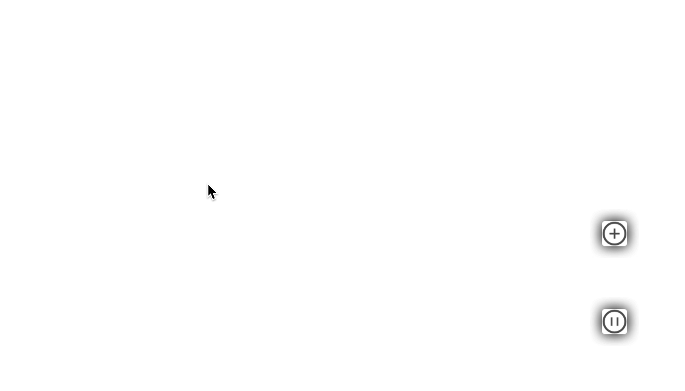
```html
<body>
  <div class="icon-container">
    <!-- 添加 icon-plus-->
    
    
  </div>
  <!-- 添加 icon-close-container 移除icon-rotate-->
  <div class="icon-close-container icon-container">
    
    
  </div>
  <!-- 添加 icon-check-container 移除icon-rotate-->
  <div class="icon-check-container icon-container">
    
    
  </div>
</body>
```
```javascript
// 大体思路就是判断容器没有icon-rotate时就加上，有就移除
const closeContainer = document.querySelector('.icon-close-container');
const checkContainer = document.querySelector('.icon-check-container');

// 声明一个变量，记录容器有还是没有icon-rotate
let isRoated = false;

document.querySelector('.icon-plus').addEventListener('click', () => {
  // 有就移除，没有就加上
  if (isRoated) {
    isRoated = false;
    closeContainer.classList.remove('icon-rotate');
    checkContainer.classList.remove('icon-rotate');
  } else {
    isRoated = true;
    closeContainer.classList.add('icon-rotate');
    checkContainer.classList.add('icon-rotate');
  }
});
```
我们发现并没有过度效果，现在来加上：
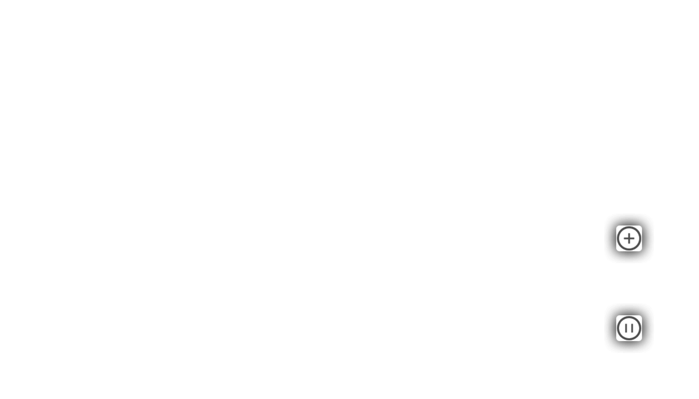
```css
.icon-container {
  position: fixed;
  right: 50px;
  bottom: 50px;
  /* 过度样式，使transform样式被加上的过度时间为0.3秒 */
  transition: transform 0.3s;
}
```
发现有闪动的问题，这是因为
```css
/* transform-origin可以设置变形的基础点。transform-origin：0 0 是元素的左上角，
这里的意思是从左上角开始，沿着x轴向右移动25像素，沿着y轴向下移动115像素，
这样就把旋转的圆心从中心位置改为了暂停图标的中心 */
.icon-rotate {
  transform-origin: 25px 115px;
}
```
我们用脚本动态添加和移除`icon-rotate`，导致旋转的圆心在中心和`25px 115px`之间来回切换，我们应该把圆心固定住：

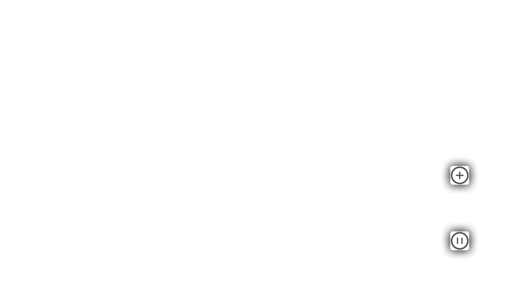
```css
.icon-rotate {
  /* transform-origin: 25px 115px; */
}
.icon-container {
  position: fixed;
  right: 50px;
  bottom: 50px;
  transition: transform 0.3s;
  /* 把该样式写到这里，这样圆心就不会随着icon-rotate的添加和移除而改变了了 */
  transform-origin: 25px 115px;
}
```
到这里我们的功能基本实现了，但是仔细观察还有一个问题，弹出图标是藏在后面的，并没有真正的隐藏，下面来隐藏：

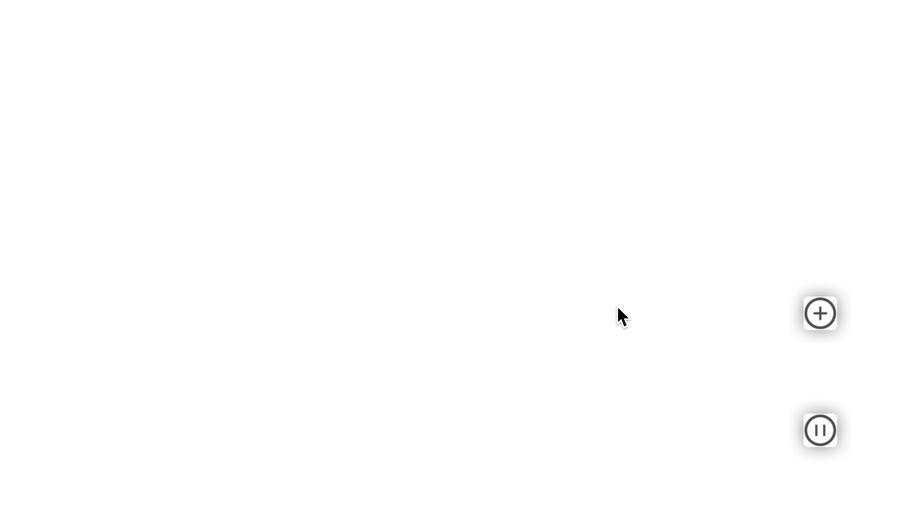
```html
<body>
  <div class="icon-container">
    
    
  </div>
  <!-- 添加一个样式 icon-hidden-->
  <div class="icon-close-container icon-container icon-hidden">
    
    <!-- 占位图标是永远隐藏的 -->
    
  </div>
  <!-- 添加一个样式 icon-hidden-->
  <div class="icon-check-container icon-container icon-hidden">
    
    <!-- 占位图标是永远隐藏的 -->
    
  </div>
</body>
```
```css
.icon-hidden {
  visibility: hidden;
}
```
```javascript
if (isRoated) {
  isRoated = false;
  closeContainer.classList.remove('icon-rotate');
  checkContainer.classList.remove('icon-rotate');
  // 添加隐藏
  closeContainer.classList.add('icon-hidden');
  checkContainer.classList.add('icon-hidden');
} else {
  isRoated = true;
  // 移除隐藏
  closeContainer.classList.remove('icon-hidden');
  checkContainer.classList.remove('icon-hidden');
  closeContainer.classList.add('icon-rotate');
  checkContainer.classList.add('icon-rotate');
}
```
隐藏后发现收起的动画不见了，这是什么原因呢？仔细阅读上面的代码，移除动画效果后，直接就添加隐藏了，也就是说动画还没走完，图标就被隐藏了，我们来修改一下：

```javascript
if (isRoated) {
  isRoated = false;
  closeContainer.classList.remove('icon-rotate');
  checkContainer.classList.remove('icon-rotate');
  // 添加隐藏
  setTimeout(() => {
    closeContainer.classList.add('icon-hidden');
    checkContainer.classList.add('icon-hidden');
  }, 300);
} else {
```
给一个300毫秒的延迟，正好动画走完隐藏掉。至此我们的功能就圆满完成了。


